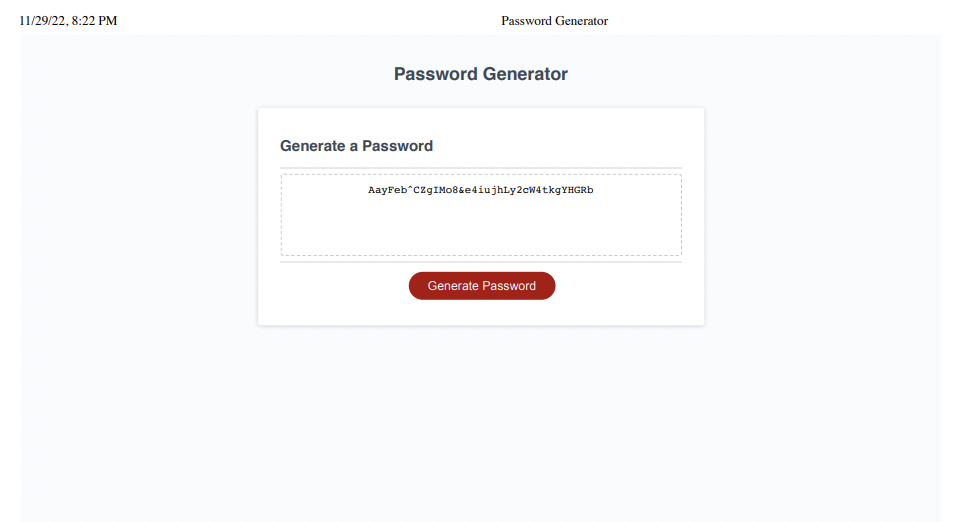

# Challenge3 - PASSWORD GENERATOR

## Description

This challenge was all about testing everything we've learned about javascript and applying cool techniques into something useful for us, which in this circustance is to generate a very random and secure password. However, I'd say that the real motivation behind this project is to get more comfortable with the programming process of how we write our pseudocode, design out our plan, and overall work out the bugs in our code to have something so simple yet complex work properly. I have previous expereince in Visual Basic and so I have an understanding on how our javascript is essentially just providing different criteria/functionality for when a set of parameters or events are set off. So, with that being said, I still found this project quite challenging in trying to fully wrap my head around achieveing the manner of which we created the final array that we would use to make our password. At the end of the day, I was really impressed with how this code works and am excited to see what's next!!! ahhh!!

## Installation

N/A

## Usage

To use this password generator, click on the generate password button to be prompted with an onset of pop-up windows that will obtain your entries in order to create your desired password which will be presented to you within the dashed border box

!link to Website:https://jenicide-1029.github.io/Password-Generator/ 